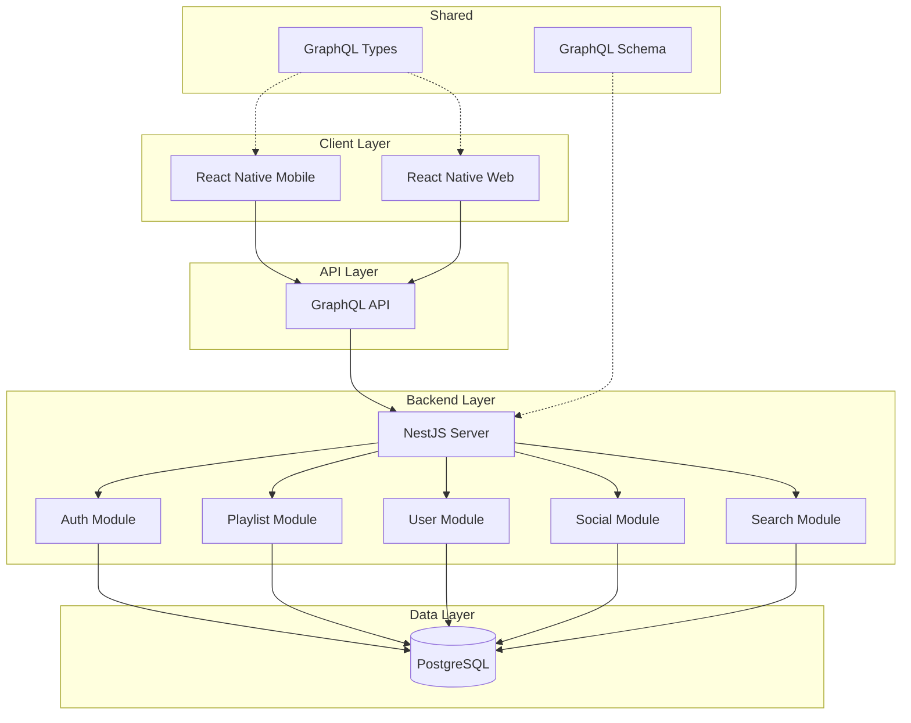

# Design Document: Mixly - 음악 플레이리스트 공유 플랫폼

## Overview

Mixly는 사용자들이 음악 플레이리스트를 생성, 공유, 탐색할 수 있는 소셜 음악 플랫폼입니다. 모노레포 구조로 React Native Expo (모바일/웹), NestJS 백엔드, 공유 GraphQL 타입을 관리합니다.

### 기술 스택
- **Frontend**: React Native Expo, NativeWind (Tailwind CSS)
- **Backend**: NestJS, GraphQL, PostgreSQL
- **Monorepo**: Moonrepo, Concurrently
- **Shared**: GraphQL 스키마 및 타입 정의

## Architecture



### 모노레포 구조

```
/
├── .moon/                    # Moonrepo 설정
├── mixly/                    # React Native Expo 앱
│   ├── app/                  # Expo Router 페이지
│   ├── components/           # UI 컴포넌트
│   ├── hooks/                # 커스텀 훅
│   ├── services/             # API 서비스
│   └── graphql/              # GraphQL 쿼리/뮤테이션
├── mixly-be/                 # NestJS 백엔드
│   ├── src/
│   │   ├── auth/             # 인증 모듈
│   │   ├── user/             # 사용자 모듈
│   │   ├── playlist/         # 플레이리스트 모듈
│   │   ├── social/           # 소셜 모듈
│   │   └── search/           # 검색 모듈
│   └── test/
├── shared/                   # 공유 모듈
│   ├── graphql/              # GraphQL 스키마 정의
│   │   ├── schema.graphql
│   │   └── types/
│   └── types/                # TypeScript 타입
└── package.json              # 루트 패키지 설정
```

## Components and Interfaces

### Frontend Components

#### 1. Authentication Components
```typescript
// components/auth/LoginForm.tsx
interface LoginFormProps {
  onSubmit: (credentials: LoginInput) => Promise<void>;
  onForgotPassword: () => void;
}

// components/auth/RegisterForm.tsx
interface RegisterFormProps {
  onSubmit: (data: RegisterInput) => Promise<void>;
}
```

#### 2. Playlist Components
```typescript
// components/playlist/PlaylistCard.tsx
interface PlaylistCardProps {
  playlist: Playlist;
  onPress: () => void;
  onLike: () => void;
}

// components/playlist/PlaylistDetail.tsx
interface PlaylistDetailProps {
  playlistId: string;
}

// components/playlist/TrackList.tsx
interface TrackListProps {
  tracks: Track[];
  onReorder: (fromIndex: number, toIndex: number) => void;
  onRemove: (trackId: string) => void;
  editable: boolean;
}
```

#### 3. Social Components
```typescript
// components/social/UserProfile.tsx
interface UserProfileProps {
  userId: string;
}

// components/social/FollowButton.tsx
interface FollowButtonProps {
  userId: string;
  isFollowing: boolean;
  onToggle: () => void;
}

// components/social/Feed.tsx
interface FeedProps {
  playlists: Playlist[];
  onLoadMore: () => void;
  hasMore: boolean;
}
```

### Backend Modules

#### 1. Auth Module
```typescript
// auth/auth.service.ts
interface AuthService {
  register(input: RegisterInput): Promise<AuthPayload>;
  login(input: LoginInput): Promise<AuthPayload>;
  refreshToken(refreshToken: string): Promise<AuthPayload>;
  requestPasswordReset(email: string): Promise<boolean>;
  resetPassword(token: string, newPassword: string): Promise<boolean>;
}
```

#### 2. Playlist Module
```typescript
// playlist/playlist.service.ts
interface PlaylistService {
  create(userId: string, input: CreatePlaylistInput): Promise<Playlist>;
  update(playlistId: string, input: UpdatePlaylistInput): Promise<Playlist>;
  delete(playlistId: string): Promise<boolean>;
  addTrack(playlistId: string, track: TrackInput): Promise<Playlist>;
  removeTrack(playlistId: string, trackId: string): Promise<Playlist>;
  reorderTracks(playlistId: string, trackIds: string[]): Promise<Playlist>;
  getById(playlistId: string): Promise<Playlist | null>;
  getByUser(userId: string, pagination: PaginationInput): Promise<PlaylistConnection>;
  getByShareLink(shareCode: string): Promise<Playlist | null>;
  generateShareLink(playlistId: string): Promise<string>;
}
```

#### 3. Social Module
```typescript
// social/social.service.ts
interface SocialService {
  follow(followerId: string, followeeId: string): Promise<boolean>;
  unfollow(followerId: string, followeeId: string): Promise<boolean>;
  likePlaylist(userId: string, playlistId: string): Promise<boolean>;
  unlikePlaylist(userId: string, playlistId: string): Promise<boolean>;
  getFeed(userId: string, pagination: PaginationInput): Promise<PlaylistConnection>;
  getFollowers(userId: string, pagination: PaginationInput): Promise<UserConnection>;
  getFollowing(userId: string, pagination: PaginationInput): Promise<UserConnection>;
}
```

#### 4. Search Module
```typescript
// search/search.service.ts
interface SearchService {
  search(query: string, filters: SearchFilters, pagination: PaginationInput): Promise<SearchResult>;
  getTrending(timeRange: TimeRange, pagination: PaginationInput): Promise<PlaylistConnection>;
}
```

## Data Models

### GraphQL Schema (shared/graphql/schema.graphql)

```graphql
type User {
  id: ID!
  email: String!
  username: String!
  displayName: String
  avatarUrl: String
  bio: String
  playlists: [Playlist!]!
  playlistCount: Int!
  followerCount: Int!
  followingCount: Int!
  createdAt: DateTime!
  updatedAt: DateTime!
}

type Playlist {
  id: ID!
  title: String!
  description: String
  coverImageUrl: String
  visibility: PlaylistVisibility!
  shareCode: String
  owner: User!
  tracks: [Track!]!
  trackCount: Int!
  likeCount: Int!
  isLiked: Boolean!
  createdAt: DateTime!
  updatedAt: DateTime!
}

type Track {
  id: ID!
  title: String!
  artist: String!
  album: String
  duration: Int!
  coverImageUrl: String
  externalUrl: String
  position: Int!
}

enum PlaylistVisibility {
  PUBLIC
  PRIVATE
}

type AuthPayload {
  accessToken: String!
  refreshToken: String!
  user: User!
}

input RegisterInput {
  email: String!
  username: String!
  password: String!
  displayName: String
}

input LoginInput {
  email: String!
  password: String!
}

input CreatePlaylistInput {
  title: String!
  description: String
  visibility: PlaylistVisibility
}

input UpdatePlaylistInput {
  title: String
  description: String
  coverImageUrl: String
  visibility: PlaylistVisibility
}

input TrackInput {
  title: String!
  artist: String!
  album: String
  duration: Int!
  coverImageUrl: String
  externalUrl: String
}

input SearchFilters {
  genre: String
  category: String
}

input PaginationInput {
  first: Int
  after: String
}

type PlaylistConnection {
  edges: [PlaylistEdge!]!
  pageInfo: PageInfo!
  totalCount: Int!
}

type PlaylistEdge {
  node: Playlist!
  cursor: String!
}

type UserConnection {
  edges: [UserEdge!]!
  pageInfo: PageInfo!
  totalCount: Int!
}

type UserEdge {
  node: User!
  cursor: String!
}

type PageInfo {
  hasNextPage: Boolean!
  hasPreviousPage: Boolean!
  startCursor: String
  endCursor: String
}

type SearchResult {
  playlists: PlaylistConnection!
  users: UserConnection!
}

type Query {
  me: User
  user(id: ID!): User
  playlist(id: ID!): Playlist
  playlistByShareCode(shareCode: String!): Playlist
  myPlaylists(pagination: PaginationInput): PlaylistConnection!
  feed(pagination: PaginationInput): PlaylistConnection!
  trending(timeRange: TimeRange, pagination: PaginationInput): PlaylistConnection!
  search(query: String!, filters: SearchFilters, pagination: PaginationInput): SearchResult!
}

type Mutation {
  register(input: RegisterInput!): AuthPayload!
  login(input: LoginInput!): AuthPayload!
  refreshToken(refreshToken: String!): AuthPayload!
  requestPasswordReset(email: String!): Boolean!
  resetPassword(token: String!, newPassword: String!): Boolean!
  
  createPlaylist(input: CreatePlaylistInput!): Playlist!
  updatePlaylist(id: ID!, input: UpdatePlaylistInput!): Playlist!
  deletePlaylist(id: ID!): Boolean!
  addTrackToPlaylist(playlistId: ID!, track: TrackInput!): Playlist!
  removeTrackFromPlaylist(playlistId: ID!, trackId: ID!): Playlist!
  reorderPlaylistTracks(playlistId: ID!, trackIds: [ID!]!): Playlist!
  generatePlaylistShareLink(playlistId: ID!): String!
  
  follow(userId: ID!): Boolean!
  unfollow(userId: ID!): Boolean!
  likePlaylist(playlistId: ID!): Boolean!
  unlikePlaylist(playlistId: ID!): Boolean!
}

enum TimeRange {
  DAY
  WEEK
  MONTH
  ALL_TIME
}

scalar DateTime
```

### PostgreSQL Entity Models

```typescript
// User Entity
@Entity('users')
class User {
  @PrimaryGeneratedColumn('uuid')
  id: string;

  @Column({ unique: true })
  email: string;

  @Column({ unique: true })
  username: string;

  @Column({ nullable: true })
  displayName: string;

  @Column()
  passwordHash: string;

  @Column({ nullable: true })
  avatarUrl: string;

  @Column({ nullable: true })
  bio: string;

  @OneToMany(() => Playlist, playlist => playlist.owner)
  playlists: Playlist[];

  @CreateDateColumn()
  createdAt: Date;

  @UpdateDateColumn()
  updatedAt: Date;
}

// Playlist Entity
@Entity('playlists')
class Playlist {
  @PrimaryGeneratedColumn('uuid')
  id: string;

  @Column()
  title: string;

  @Column({ nullable: true })
  description: string;

  @Column({ nullable: true })
  coverImageUrl: string;

  @Column({ type: 'enum', enum: PlaylistVisibility, default: 'PRIVATE' })
  visibility: PlaylistVisibility;

  @Column({ unique: true, nullable: true })
  shareCode: string;

  @ManyToOne(() => User, user => user.playlists)
  owner: User;

  @Column()
  ownerId: string;

  @OneToMany(() => PlaylistTrack, pt => pt.playlist)
  playlistTracks: PlaylistTrack[];

  @CreateDateColumn()
  createdAt: Date;

  @UpdateDateColumn()
  updatedAt: Date;
}

// Track Entity
@Entity('tracks')
class Track {
  @PrimaryGeneratedColumn('uuid')
  id: string;

  @Column()
  title: string;

  @Column()
  artist: string;

  @Column({ nullable: true })
  album: string;

  @Column()
  duration: number;

  @Column({ nullable: true })
  coverImageUrl: string;

  @Column({ nullable: true })
  externalUrl: string;
}

// PlaylistTrack (Join Table with ordering)
@Entity('playlist_tracks')
class PlaylistTrack {
  @PrimaryGeneratedColumn('uuid')
  id: string;

  @ManyToOne(() => Playlist, playlist => playlist.playlistTracks)
  playlist: Playlist;

  @Column()
  playlistId: string;

  @ManyToOne(() => Track)
  track: Track;

  @Column()
  trackId: string;

  @Column()
  position: number;
}

// Follow Entity
@Entity('follows')
class Follow {
  @PrimaryGeneratedColumn('uuid')
  id: string;

  @ManyToOne(() => User)
  follower: User;

  @Column()
  followerId: string;

  @ManyToOne(() => User)
  followee: User;

  @Column()
  followeeId: string;

  @CreateDateColumn()
  createdAt: Date;
}

// Like Entity
@Entity('likes')
class Like {
  @PrimaryGeneratedColumn('uuid')
  id: string;

  @ManyToOne(() => User)
  user: User;

  @Column()
  userId: string;

  @ManyToOne(() => Playlist)
  playlist: Playlist;

  @Column()
  playlistId: string;

  @CreateDateColumn()
  createdAt: Date;
}
```


## Correctness Properties

*A property is a characteristic or behavior that should hold true across all valid executions of a system-essentially, a formal statement about what the system should do. Properties serve as the bridge between human-readable specifications and machine-verifiable correctness guarantees.*

### Property 1: Authentication Token Round-Trip
*For any* valid user credentials, logging in and then using the returned tokens to access protected resources should successfully authenticate the user.
**Validates: Requirements 1.1, 1.2, 1.5**

### Property 2: Invalid Credentials Rejection
*For any* invalid credential combination (wrong email or password), the system should reject the login attempt and return an error.
**Validates: Requirements 1.3**

### Property 3: Playlist Creation Persistence
*For any* valid playlist input (title, description), creating a playlist should result in a retrievable playlist with matching data associated with the creating user.
**Validates: Requirements 2.1**

### Property 4: Track Count Invariant
*For any* playlist, the track count should always equal the actual number of tracks in the playlist after any add or remove operation.
**Validates: Requirements 2.2, 2.3**

### Property 5: Track Reorder Persistence
*For any* playlist with tracks, reordering the tracks should persist the new order, and retrieving the playlist should return tracks in the specified order.
**Validates: Requirements 2.4**

### Property 6: Playlist Deletion Completeness
*For any* deleted playlist, querying for that playlist should return null/not found, and associated track references should be removed.
**Validates: Requirements 2.5**

### Property 7: Playlist Metadata Update Persistence
*For any* playlist metadata update (title, description, cover image), the changes should be persisted and retrievable.
**Validates: Requirements 2.6**

### Property 8: Visibility Access Control
*For any* playlist, if visibility is PUBLIC then any user can access it, if visibility is PRIVATE then only the owner can access it (except via share link).
**Validates: Requirements 3.1, 3.2**

### Property 9: Share Link Uniqueness and Access
*For any* generated share link, the link should be unique and allow access to the playlist regardless of visibility setting.
**Validates: Requirements 3.3, 3.4**

### Property 10: Follow/Unfollow Round-Trip
*For any* user pair, following then unfollowing should result in the same state as before following (not in following list).
**Validates: Requirements 4.1, 4.2**

### Property 11: Like Count Invariant
*For any* playlist, the like count should equal the actual number of users who have liked it, and liking then unliking should restore the original count.
**Validates: Requirements 4.3, 4.4**

### Property 12: Feed Ordering
*For any* user's feed, playlists should be from followed users only and ordered by creation date (newest first).
**Validates: Requirements 4.5**

### Property 13: Search Result Relevance
*For any* search query, all returned playlists and users should contain the search keyword in their title, description, or username.
**Validates: Requirements 5.1**

### Property 14: Trending Order
*For any* trending query, playlists should be ordered by like count in descending order within the specified time range.
**Validates: Requirements 5.2**

### Property 15: Search Filter Correctness
*For any* filtered search, all returned playlists should match the specified filter criteria (genre/category).
**Validates: Requirements 5.3**

### Property 16: Pagination Consistency
*For any* paginated query, the page size should not exceed the requested limit, and cursor-based navigation should return consistent results.
**Validates: Requirements 5.4**

### Property 17: GraphQL Serialization Round-Trip
*For any* valid Playlist object, serializing to GraphQL response and deserializing back should produce an equivalent object with all fields preserved.
**Validates: Requirements 6.1, 6.2, 6.3**

### Property 18: Malformed Input Rejection
*For any* malformed GraphQL input, the system should return a validation error with a descriptive message.
**Validates: Requirements 6.4**

## Error Handling

### Authentication Errors
| Error Code | Description | HTTP Status |
|------------|-------------|-------------|
| AUTH_INVALID_CREDENTIALS | Email or password is incorrect | 401 |
| AUTH_USER_NOT_FOUND | User does not exist | 404 |
| AUTH_TOKEN_EXPIRED | Access token has expired | 401 |
| AUTH_TOKEN_INVALID | Token is malformed or invalid | 401 |
| AUTH_EMAIL_EXISTS | Email already registered | 409 |
| AUTH_USERNAME_EXISTS | Username already taken | 409 |

### Playlist Errors
| Error Code | Description | HTTP Status |
|------------|-------------|-------------|
| PLAYLIST_NOT_FOUND | Playlist does not exist | 404 |
| PLAYLIST_ACCESS_DENIED | User does not have access to this playlist | 403 |
| PLAYLIST_INVALID_INPUT | Invalid playlist data provided | 400 |
| TRACK_NOT_FOUND | Track does not exist in playlist | 404 |

### Social Errors
| Error Code | Description | HTTP Status |
|------------|-------------|-------------|
| USER_NOT_FOUND | User does not exist | 404 |
| ALREADY_FOLLOWING | Already following this user | 409 |
| NOT_FOLLOWING | Not following this user | 400 |
| ALREADY_LIKED | Already liked this playlist | 409 |
| NOT_LIKED | Haven't liked this playlist | 400 |

### GraphQL Error Response Format
```typescript
interface GraphQLError {
  message: string;
  extensions: {
    code: string;
    statusCode: number;
    details?: Record<string, any>;
  };
}
```

## Testing Strategy

### Property-Based Testing Framework
- **Library**: fast-check (TypeScript)
- **Minimum Iterations**: 100 per property test
- **Test Annotation Format**: `**Feature: music-playlist-sharing, Property {number}: {property_text}**`

### Unit Testing
- Test specific edge cases and error conditions
- Test individual service methods in isolation
- Test GraphQL resolvers with mocked services
- Use Jest as the testing framework

### Property-Based Tests
Each correctness property will be implemented as a property-based test:

1. **Authentication Properties (1-2)**: Generate random valid/invalid credentials and verify token behavior
2. **Playlist CRUD Properties (3-7)**: Generate random playlist data and verify persistence
3. **Visibility Properties (8-9)**: Generate playlists with different visibility settings and verify access control
4. **Social Properties (10-12)**: Generate user interactions and verify state consistency
5. **Search Properties (13-16)**: Generate search queries and verify result correctness
6. **Serialization Properties (17-18)**: Generate playlist objects and verify round-trip consistency

### Test Structure
```
mixly-be/
├── src/
│   ├── auth/
│   │   ├── auth.service.spec.ts        # Unit tests
│   │   └── auth.property.spec.ts       # Property tests
│   ├── playlist/
│   │   ├── playlist.service.spec.ts    # Unit tests
│   │   └── playlist.property.spec.ts   # Property tests
│   ├── social/
│   │   ├── social.service.spec.ts      # Unit tests
│   │   └── social.property.spec.ts     # Property tests
│   └── search/
│       ├── search.service.spec.ts      # Unit tests
│       └── search.property.spec.ts     # Property tests
└── test/
    └── e2e/                            # End-to-end tests
```

### Test Data Generators (fast-check)
```typescript
// Generators for property-based testing
const userGenerator = fc.record({
  email: fc.emailAddress(),
  username: fc.string({ minLength: 3, maxLength: 20 }).filter(s => /^[a-zA-Z0-9_]+$/.test(s)),
  password: fc.string({ minLength: 8, maxLength: 50 }),
  displayName: fc.option(fc.string({ minLength: 1, maxLength: 50 })),
});

const playlistGenerator = fc.record({
  title: fc.string({ minLength: 1, maxLength: 100 }),
  description: fc.option(fc.string({ maxLength: 500 })),
  visibility: fc.constantFrom('PUBLIC', 'PRIVATE'),
});

const trackGenerator = fc.record({
  title: fc.string({ minLength: 1, maxLength: 200 }),
  artist: fc.string({ minLength: 1, maxLength: 100 }),
  album: fc.option(fc.string({ maxLength: 100 })),
  duration: fc.integer({ min: 1, max: 36000 }), // 1 second to 10 hours
});
```
